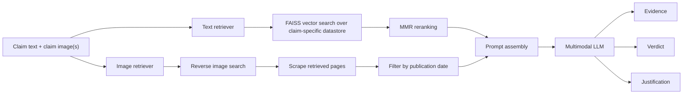

# CTU AIC AVerImaTeC System

[](https://arxiv.org/abs/2602.15190)

This repository contains the CTU AIC submission system for the AVerImaTeC shared task on automatic verification of image-text claims with evidence from the web. The system combines text retrieval over an offline knowledge store with image retrieval via reverse image search, then asks a multimodal LLM to generate evidence, a verdict, and a justification in a single pass.

Our submission ranked 3rd on the AVerImaTeC leaderboard. The design goal is a strong, relatively affordable multimodal fact-checking pipeline that stays modular and easy to adapt.

## Overview

The system follows a dual-retrieval retrieval-augmented generation pipeline:



At a high level, the pipeline has three stages:

1. `Text-based retrieval`
   The provided text-only AVerImaTeC knowledge store is chunked, embedded with `mixedbread-ai/mxbai-embed-large-v1`, retrieved with FAISS, and diversified with maximal marginal relevance.
2. `Image-based retrieval`
   Each claim image is handled separately with reverse image search. Retrieved pages are scraped, filtered to keep only evidence that predates the claim, and represented as image-related sources.
3. `Generation`
   A multimodal LLM receives the claim, claim images, and both source sets, then produces evidence, a final label, and a justification. The output is post-processed into AVerImaTeC submission format.

## What Is In This Repository

The core implementation lives in [`src/`](src):

- [`src/mm_checker.py`](src/mm_checker.py) contains the main multimodal fact-checking loop, including question generation, answering, verification, and justification.
- [`src/retrieval.py`](src/retrieval.py) defines the FAISS-based text retrievers and attaches reverse-image-search results to each datapoint.
- [`src/evidence_generation.py`](src/evidence_generation.py) converts model outputs into evidence objects and submission-ready evidence entries.
- [`src/pipeline.py`](src/pipeline.py) wires retrieval, evidence generation, and classification into a reusable pipeline abstraction.
- [`src/classification.py`](src/classification.py) provides verdict prediction utilities.
- [`src/config.py`](src/config.py) defines the main CLI flags.
- [`src/dynamic_mm_fc/`](src/dynamic_mm_fc) contains modular components for question generation, planning, QA, verification, summarization, prompts, and web tooling.

Supporting utilities:

- [`prepare_submission/`](prepare_submission) contains conversion and offline evaluation helpers.
- [`templates/`](templates) contains prompt and evaluation templates.
- [`script/`](script) contains cluster job scripts and evaluation wrappers.

## System Details

### Text Retrieval

- Offline knowledge is stored per claim and loaded from a FAISS index.
- The retriever uses exact vector similarity search and MMR reranking for better coverage and lower redundancy.
- In the paper setup, 20 nearest neighbors are retrieved and reranked down to 7 final text sources.

### Image Retrieval

- Reverse image search is run independently for each claim image.
- Retrieved pages are scraped into LLM-friendly text.
- Sources published after the claim date are filtered out to preserve temporal validity of evidence.
- Image-related sources are passed to the generator with dedicated numeric source IDs.

### Generation and Output

- The generator consumes text-related and image-related sources in one prompt.
- Few-shot evidence examples are retrieved with BM25 and added to improve format adherence.
- The model produces evidence, verdict, and justification in one pass.
- Evidence is then converted into AVerImaTeC-style evidence text, with image markers when image-grounded sources are used.

## Requirements

The lightweight dependency snapshot in [`essential_requirement.txt`](essential_requirement.txt) lists the core versions used in this project:

- Python `3.9.17`
- PyTorch `2.4.0+cu121`
- Transformers `4.50.2`
- Accelerate `0.33.0`

The code also depends on additional libraries used throughout the pipeline, including FAISS/LangChain integration, `rank-bm25`, `nltk`, and model- or API-specific packages depending on the selected backend.

## Data Layout

Expected local layout:

```text
data/
  data_clean/
    images/
    split_data/
      train.json
      val.json
      test.json
```

If you use the offline datastore, point `--DATASTORE_PATH` to the downloaded FAISS-backed knowledge store.

The project also expects API credentials or local model access depending on the chosen configuration. Sensitive files under `private_info/` must remain uncommitted.

## Running The System

The main entry point for end-to-end fact-checking is [`src/mm_checker.py`](src/mm_checker.py).

Example debug run:

```bash
python src/mm_checker.py \
  --ROOT_PATH /absolute/path/to/AVerImaTec_Shared_Task \
  --TEST_MODE val \
  --LLM_NAME qwen \
  --MLLM_NAME qwen \
  --DATA_STORE True \
  --DATASTORE_PATH /absolute/path/to/datastore \
  --DEBUG True
```

Example with parallel question generation:

```bash
python src/mm_checker.py \
  --ROOT_PATH /absolute/path/to/AVerImaTec_Shared_Task \
  --TEST_MODE val \
  --LLM_NAME gemma \
  --MLLM_NAME gemma \
  --DATA_STORE True \
  --DATASTORE_PATH /absolute/path/to/datastore \
  --PARA_QG True
```

Relevant CLI flags from [`src/config.py`](src/config.py):

- `--PARA_QG True` enables parallel question generation.
- `--HYBRID_QG True` enables hybrid question generation.
- `--QG_ICL True` enables few-shot question generation.
- `--NO_SEARCH True` skips retrieval and reuses precomputed questions.
- `--GT_QUES True` and `--GT_EVID True` switch to oracle-style evaluation modes.

Outputs are written under `fc_detailed_results/<llm>_<mllm>/<save_num>.pkl` in the repository root specified by `--ROOT_PATH`.

## Submission And Evaluation

The repository keeps the original submission utilities:

- Convert detailed outputs to the official submission format with [`prepare_submission/ipython/Result_Convert.ipynb`](prepare_submission/ipython/Result_Convert.ipynb).
- Run offline evaluation with [`prepare_submission/eval_offline.py`](prepare_submission/eval_offline.py) or the wrapper scripts in [`script/`](script).

Example evaluation command:

```bash
python prepare_submission/eval_offline.py \
  --root_dir /absolute/path/to/AVerImaTec_Shared_Task \
  --llm_name gemma \
  --mllm_name gemma \
  --save_num 12 \
  --eval_model google/gemma-3-27b-it
```

## Results

In the shared-task submission described in the paper, the system achieved:

- Question score: `0.81`
- Evidence score: `0.33`
- Verdict accuracy: `0.35`
- Justification score: `0.30`

This placed the system 3rd overall on the AVerImaTeC leaderboard.

## Paper

The README summarizes the system described in the accompanying arXiv paper:

- [arXiv:2602.15190](https://arxiv.org/abs/2602.15190)

If you use this repository, please cite the paper and acknowledge the AVerImaTeC shared task and dataset.
